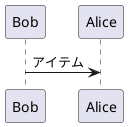

# このツールは？
AWS Translatorを利用して、markdownファイルを翻訳します。

# 使い方

```
markdown_translator < マークダウンテキストファイル(.md)
```

# 翻訳テスト

コード
```javascript
ABCDEF あいうえお
```



リスト
- リスト1
    - ネスト リスト1_1
        - ネスト リスト1_1_1
        - ネスト リスト1_1_2
    - ネスト リスト1_2
- リスト2
- リスト3

引用
> お世話になります。xxxです。
>
> ご連絡いただいた、バグの件ですが、仕様です。

リンク
[Google先生](https://www.google.co.jp/)

表
|  名前  |  住所  |
| ---- | ---- |
|  佐藤　単純  |  大阪府  |
|  明確　らんらん  |  福井県  |
